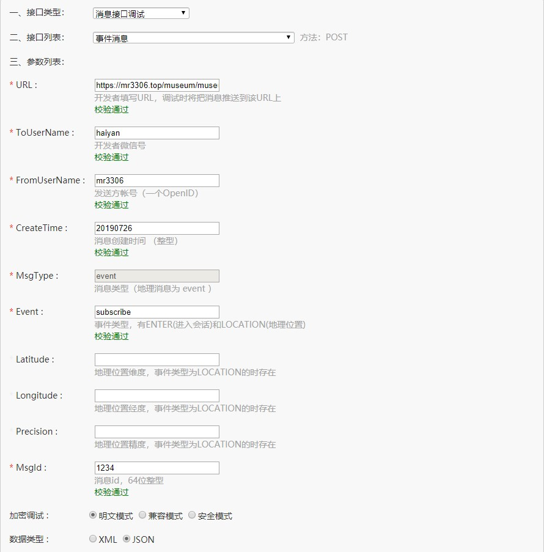
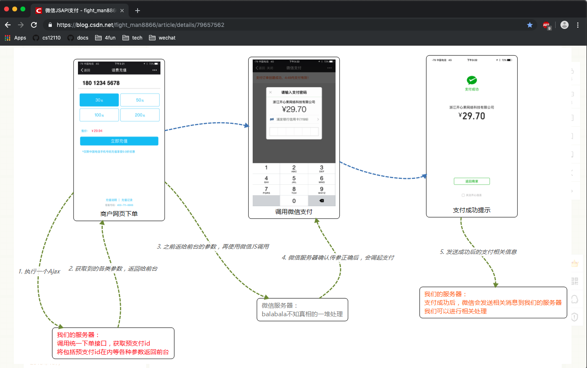

# 微信公众号

微信公众号官方文档: [link](https://mp.weixin.qq.com/wiki?t=resource/res_main&id=mp1421140183)

因为是个人的公众号,所以几乎没什么能玩的.

---

## 1. 公众号配置

注意: <u>一个邮箱只能注册一个微信东西,如果你的邮箱注册了小程序,想注册公众号的话,必须换另一个邮箱.</u>

### 1.1 公众号配置属性

| 配置名称              | 配置值                           |
| --------------------- | -------------------------------- |
| 开发者 ID(AppID)      | wx13a560116ac43e71               |
| 开发者密码(AppSecret) | c39049de02354bb7c81c47d13b66d8d6 |

### 1.2 获取 AccessToken

微信公众号的 AccessToken 会在 7200 秒后过期,因此在生产环境里面需要定时的刷新这个 token.

---

## 2. 相关代码

### 2.1 公众号接入代码

```java
/**
* 微信公众号接入接口,与其他事件是同一个接口
* <p>
* 比如用户在公众号输入关键字的时候,会能通过try2Read方法获取到 orz
*
* @param request request
* @return String
*/
@RequestMapping("/bigbang")
@ResponseBody
public Object bigbang(HttpServletRequest request) {
    logger.info("Http method:{}", request.getMethod());
    logger.info("Http url:{}", request.getRequestURI());

    String reqValue = try2Read(request);
    logger.info("\n{}", reqValue);

    Enumeration<String> parameterNames = request.getParameterNames();
    Map<String, Object> map = new HashMap<>();
    while (parameterNames.hasMoreElements()) {
        String key = parameterNames.nextElement();
        map.put(key, request.getParameter(key));
    }

    logger.info("\n{}", JSON.toJSONString(map, true));

    return map.get("echostr");
}

/**
* 读取事件内容
*
* @param request 请求
* @return String
*/
private String try2Read(HttpServletRequest request) {
    StringBuilder builder = new StringBuilder();
    try (ServletInputStream stream = request.getInputStream()) {
        byte[] arr = new byte[1024];
        int len;
        while (-1 != (len = stream.read(arr))) {
            builder.append(new String(arr, 0, len));
        }
    } catch (Exception e) {
        logger.error("", e);
    }
    return builder.toString();
}
```

例如通过页面调用测试[test page](https://mp.weixin.qq.com/debug/cgi-bin/apiinfo?t=index&type=%E8%87%AA%E5%AE%9A%E4%B9%89%E8%8F%9C%E5%8D%95&form=%E8%87%AA%E5%AE%9A%E4%B9%89%E8%8F%9C%E5%8D%95%E5%88%9B%E5%BB%BA%E6%8E%A5%E5%8F%A3%20/menu/creat)



接口接受到微信传输过来的消息如下

```java
2019-07-26 16:12:29 INFO  com.pkgs.museum.ctrl.MuseumCtrl:57 - 
<xml><ToUserName><![CDATA[gh_aa25bff261ad]]></ToUserName>
<FromUserName><![CDATA[oX1LUwPSirpY4DxJy2ELVN1PLyJo]]></FromUserName>
<CreateTime>1564128749</CreateTime>
<MsgType><![CDATA[event]]></MsgType>
<Event><![CDATA[unsubscribe]]></Event>
<EventKey><![CDATA[]]></EventKey>
</xml>
2019-07-26 16:12:29 INFO  com.pkgs.museum.ctrl.MuseumCtrl:66 - 
{
	"signature":"a24e385f6910233dbe2690227f18df19f34aee23",
	"openid":"oX1LUwPSirpY4DxJy2ELVN1PLyJo",
	"nonce":"451746180",
	"timestamp":"1564128749"
}
2019-07-26 16:12:40 INFO  com.pkgs.museum.ctrl.MuseumCtrl:53 - Http method:POST
2019-07-26 16:12:40 INFO  com.pkgs.museum.ctrl.MuseumCtrl:54 - Http url:/museum/bigbang
2019-07-26 16:12:40 INFO  com.pkgs.museum.ctrl.MuseumCtrl:57 - 
<xml><ToUserName><![CDATA[gh_aa25bff261ad]]></ToUserName>
<FromUserName><![CDATA[oX1LUwPSirpY4DxJy2ELVN1PLyJo]]></FromUserName>
<CreateTime>1564128760</CreateTime>
<MsgType><![CDATA[event]]></MsgType>
<Event><![CDATA[subscribe]]></Event>
<EventKey><![CDATA[]]></EventKey>
</xml>
2019-07-26 16:12:40 INFO  com.pkgs.museum.ctrl.MuseumCtrl:66 - 
{
	"signature":"6e9410625ede92b9bb825a18bd9f853f9d912304",
	"openid":"oX1LUwPSirpY4DxJy2ELVN1PLyJo",
	"nonce":"1728347185",
	"timestamp":"1564128760"
}
2019-07-26 16:12:46 INFO  com.pkgs.museum.ctrl.MuseumCtrl:53 - Http method:POST
2019-07-26 16:12:46 INFO  com.pkgs.museum.ctrl.MuseumCtrl:54 - Http url:/museum/bigbang
2019-07-26 16:12:46 INFO  com.pkgs.museum.ctrl.MuseumCtrl:57 - 
<xml><ToUserName><![CDATA[gh_aa25bff261ad]]></ToUserName>
<FromUserName><![CDATA[oX1LUwPSirpY4DxJy2ELVN1PLyJo]]></FromUserName>
<CreateTime>1564128766</CreateTime>
<MsgType><![CDATA[text]]></MsgType>
<Content><![CDATA[1234]]></Content>
<MsgId>22392940488661025</MsgId>
</xml>
2019-07-26 16:12:46 INFO  com.pkgs.museum.ctrl.MuseumCtrl:66 - 
{
	"signature":"56823ec2ff7fe8b94d5e049ffed0244639fe7223",
	"openid":"oX1LUwPSirpY4DxJy2ELVN1PLyJo",
	"nonce":"954795297",
	"timestamp":"1564128766"
}
```

```java
2019-07-26 17:07:19 INFO  com.pkgs.museum.ctrl.MuseumCtrl:35 - Http method:POST
2019-07-26 17:07:19 INFO  com.pkgs.museum.ctrl.MuseumCtrl:36 - Http uri:/museum/bigbang
2019-07-26 17:07:19 INFO  com.pkgs.museum.ctrl.MuseumCtrl:37 - Http url:http://127.0.0.1:7070/museum/bigbang
2019-07-26 17:07:19 INFO  com.pkgs.museum.ctrl.MuseumCtrl:42 - Head host:127.0.0.1:7070
2019-07-26 17:07:19 INFO  com.pkgs.museum.ctrl.MuseumCtrl:42 - Head connection:close
2019-07-26 17:07:19 INFO  com.pkgs.museum.ctrl.MuseumCtrl:42 - Head content-length:278
2019-07-26 17:07:19 INFO  com.pkgs.museum.ctrl.MuseumCtrl:42 - Head user-agent:Mozilla/4.0
2019-07-26 17:07:19 INFO  com.pkgs.museum.ctrl.MuseumCtrl:42 - Head accept:*/*
2019-07-26 17:07:19 INFO  com.pkgs.museum.ctrl.MuseumCtrl:42 - Head pragma:no-cache
2019-07-26 17:07:19 INFO  com.pkgs.museum.ctrl.MuseumCtrl:42 - Head content-type:text/xml
```

---

## 3. 通用接口类型

通用接口类型可以在这个页面找到相关文档: [link](https://mp.weixin.qq.com/wiki?t=resource/res_main&id=mp1421140454)

然后可以在这个页面上进行测试操作: [link](https://mp.weixin.qq.com/wiki?t=resource/res_main&id=mp1421140454)


---

## 4. 支付接口

支付流程参考博客: [link](https://blog.csdn.net/fight_man8866/article/details/79657562)

因为没有相关条件来测试,现在只能熟悉流程了.微信支付接口流程

